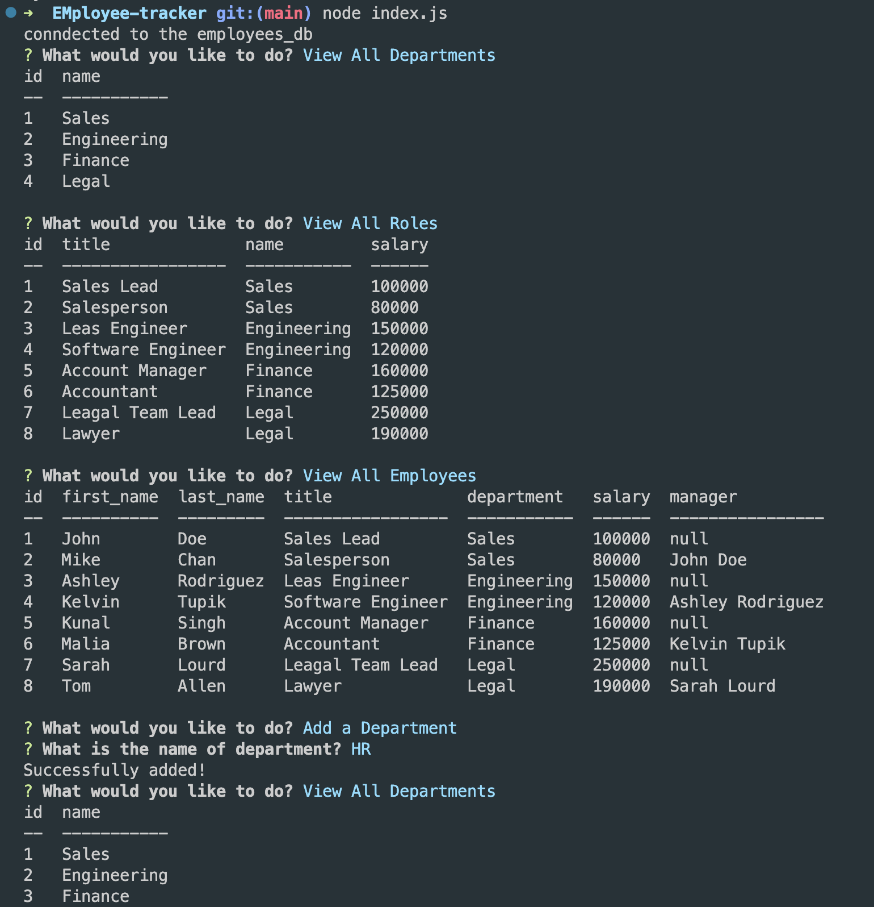

# EMployee-tracker

The Employee trakcer is a command-line application that allows you to manage departments, roles, and employees within a company. It provides functionality for viewing, adding, and updating various aspects of the company's organizational structure.

## Table of Contents

- [Installation](#installation)
- [Usage](#usage)
- [Features](#features)
- [Technologies](#technologies)

## Installation

1. Clone the repository to your local machine.
```
git clone https://github.com/Hiroro1989/EMployee-tracker.git
```

2. Navigate to the project directory.
```
cd <saved-directory>
```

3. Install the dependencies.
```
npm install
```

4. Set up the database.

- Create a MySQL database using the provided SQL schema file (schema.sql).
- Update the database connection details in the index.js file to match your MySQL configuration.

## Usage

1. Start the application.
```
node index.js
```

2. The main menu will be displayed with a list of available actions. Use the arrow keys to navigate and press Enter to select an action.

3. Follow the prompts to perform the selected action. The application will guide you through the necessary steps to view, add, or update departments, roles, and employees.

4. Use the "Quit" option to exit the application.

## Features

- View all departments, roles, and employees 
- Add new departments, roles, and employees to the database.
- Update an employee's role.
- Quit the application.

## Technologies

- Node.js
- MySQL
- npm
- Inquirer.js
- mysql2
- console.table

## Demo and Screenshots

[Demo Video](https://drive.google.com/file/d/1XPeblG11EH_ngPA0ObIU1zALoAO6NuJL/view)



